# KWGT Widgets

A list of widgets i made on KWGT.

## IMPORTANT NOTE

All widgets listed here are dependant on Material You colors, so i can't guarantee it might work below Android 12.

## orangeish

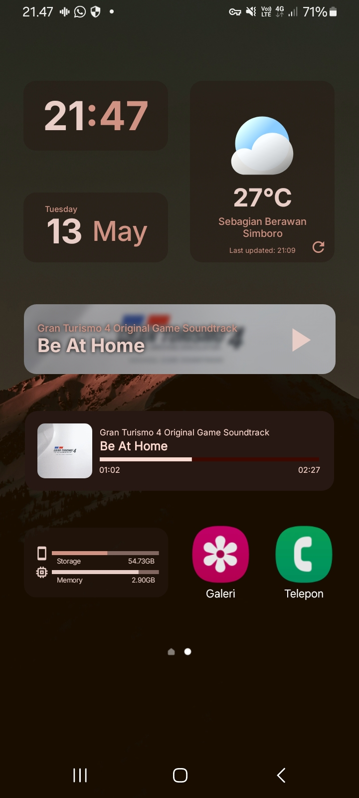

A grid layout widget, with orange as the main colorscheme.

### Clock

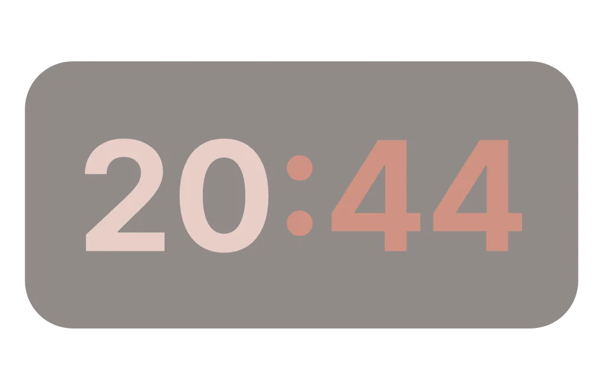

[Download widget](./orangeish/Clock_orangeish.kwgt)

### Date

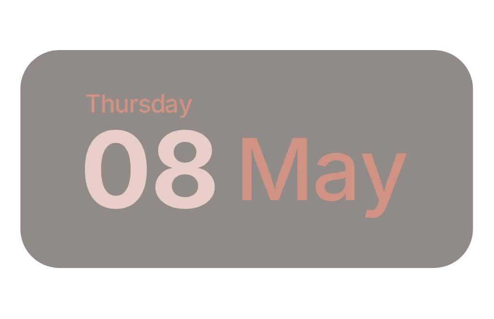

[Download widget](./orangeish/Date_orangeish.kwgt)

### Storage

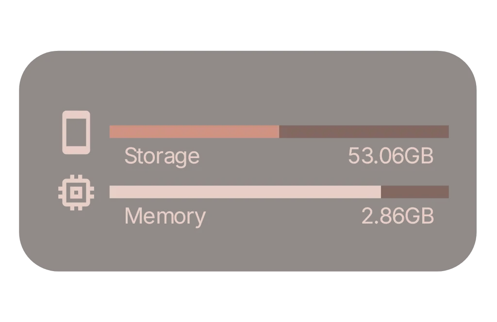

[Download widget](./orangeish/Memory_Info_orangeish.kwgt)

### Music Player

[Download widget](./orangeish/Music_orangeish.kwgt)

### Weather

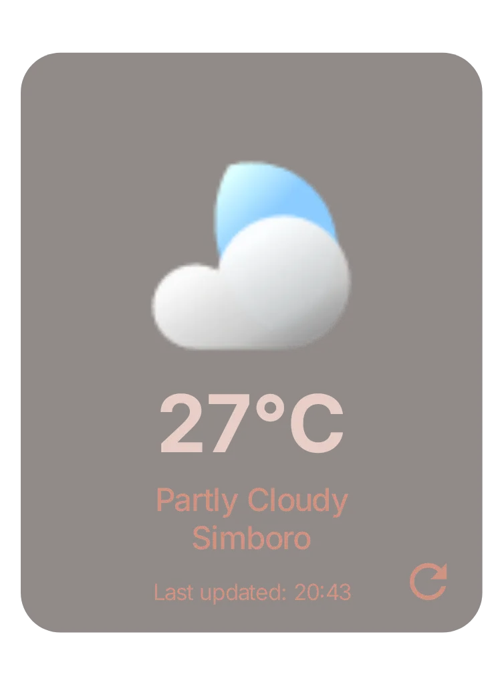

[Download widget](./orangeish/Weather_orangeish.kwgt)

## sides

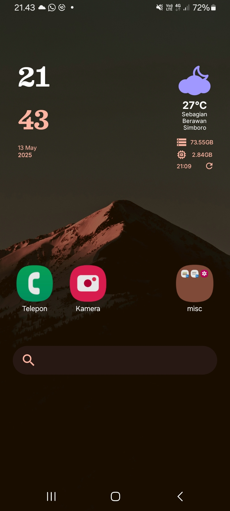

A vertical widget minipack that is meant to be used at the sides of the screen.

### Clock

[Download widget](./sides/Clock_sides.kwgt)

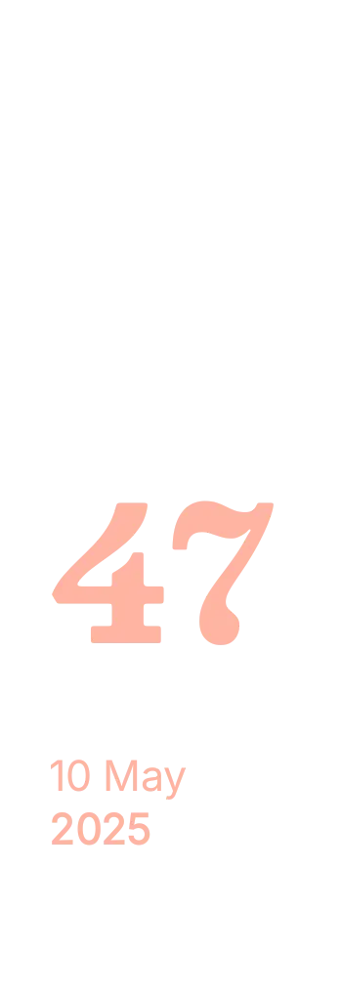

[Download widget](./sides-1/Clock___sides.kwgt)

### Weather

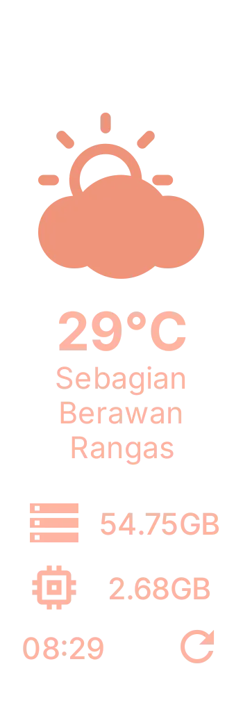

[Download widget](./sides/Weather_sides.kwgt)

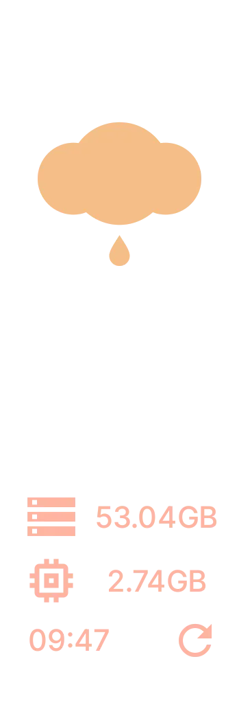

[Download widget](./sides-1/Weather___sides.kwgt)

## Other

### Searchbar

[Download widget](./other/Searchbar.kwgt)

### Player without Play/Pause

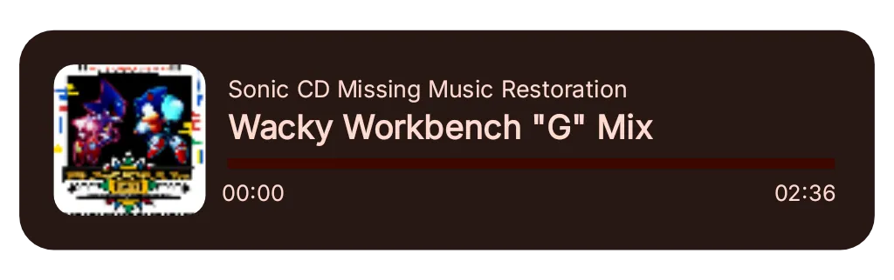

[Download widget](./other/Music.kwgt)

### Pie Clock

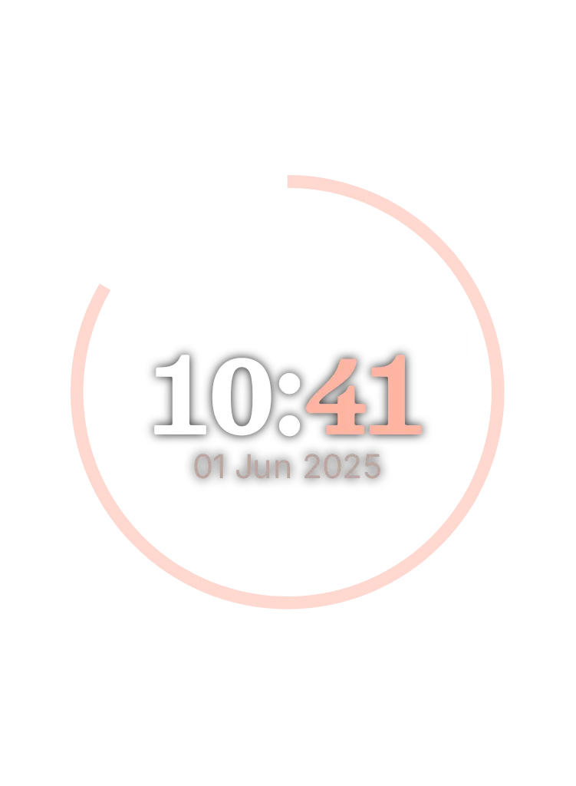

[Download widget](./other/Pie_Clock.kwgt)
